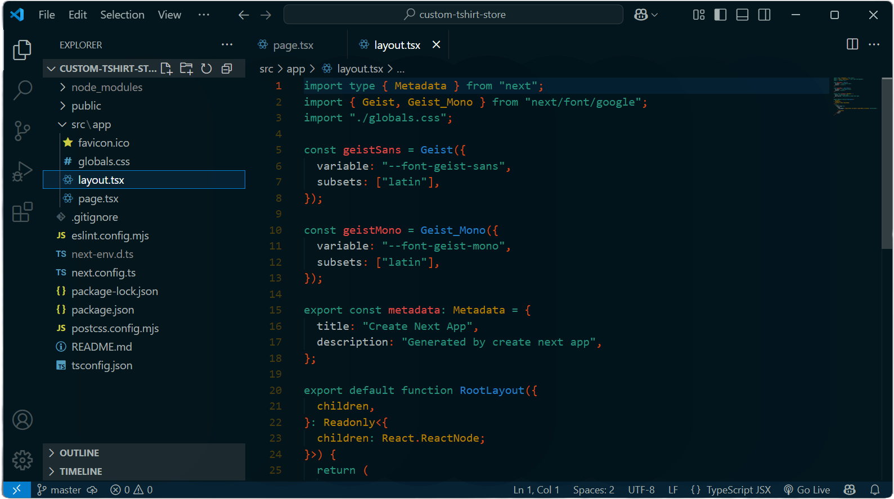

# Solarized Osaka Theme for VS Code

[](https://marketplace.visualstudio.com/items?itemName=benomas.solarized-osaka)
[](https://marketplace.visualstudio.com/items?itemName=benomas.solarized-osaka)
[](https://marketplace.visualstudio.com/items?itemName=benomas.solarized-osaka)

**Solarized Osaka** is a powerful VS Code theme that boosts your productivity while reducing eye strain. Combining the scientific readability principles of Solarized with Osaka's vibrant energy, it delivers an exceptional developer experience through carefully calibrated colors, semantic precision, and distraction-free UI. Write better code, faster, with less fatigue.


---

## Features

- ✨ **Enhanced Readability & Focus** - Scientifically calibrated colors reduce eye strain during long coding sessions while maintaining optimal contrast between code elements, helping you stay focused and productive for hours.

- 🎭 **Semantic Intelligence** - Advanced semantic highlighting differentiates variables, functions, and language-specific elements with thoughtful color choices that make code structure instantly recognizable, reducing cognitive load.

- 🧠 **Cognitive Optimization** - Intentional color relationships and contrast levels help your brain process information efficiently, making code navigation and pattern recognition faster and more intuitive.

- 🌈 **Language Versatility** - Consistent and meaningful syntax highlighting across multiple programming languages ensures you get the same smooth experience whether you're writing JavaScript, Python, or CSS.

- 🖥️ **Distraction-Free Environment** - Clean UI elements with carefully balanced visual hierarchy let you focus on your code, not your IDE, creating a seamless development experience that gets out of your way.

---

## Screenshot

Here's a preview of the Solarized Osaka theme in action:



---

## Color Palette

| Element              | Color Code | Preview/Description                            |
|----------------------|------------|------------------------------------------------|
| Background           | `#011219`  | Deep dark blue-green base background           |
| Foreground           | `#839496`  | Pleasant teal-gray for primary text            |
| Comments             | `#4a6369`  | Muted blue-gray that's visible but unobtrusive |
| Strings              | `#269374`  | Vibrant teal for string literals               |
| Keywords             | `#cb4b16`  | Bright orange for language keywords            |
| Functions            | `#2aa198`  | Cyan that stands out for function names        |
| Variables            | `#839496`  | Consistent with foreground for readability     |
| Types                | `#b58900`  | Yellow for class and type definitions          |
| Numbers              | `#d33682`  | Magenta for numeric literals                   |
| Constants            | `#6c71c4`  | Purple for constant values                     |
| Operators            | `#93a1a1`  | Light blue-gray for operators                  |
| Parameters           | `#657b83`  | Slightly darker than variables for distinction |
| Selection            | `#073642`  | Darker blue-green for text selections          |
| Line Highlight       | `#032536`  | Subtle highlight for the current line          |
| Widget Background    | `#01151d`  | Slightly lighter than background for widgets   |
| Status Bar           | `#01121a`  | Dark bluish for the bottom status bar          |
| Activity Bar         | `#011018`  | Nearly black blue for the side activity bar    |

---

## Getting Started

### Prerequisites

- Visual Studio Code (1.60.0 or higher recommended)

### Installation

**Option 1: VS Code Marketplace**

1. Open VS Code
2. Press `Ctrl+Shift+X` (Windows/Linux) or `Cmd+Shift+X` (Mac) to open Extensions
3. Search for "Solarized Osaka"
4. Click Install

**Option 2: Manual Installation**

1. Download the latest `.vsix` file from the [releases page](https://github.com/benomas/solarized-osaka-vscode/releases)
2. Open VS Code
3. Press `Ctrl+Shift+X` (Windows/Linux) or `Cmd+Shift+X` (Mac) to open Extensions
4. Click the `...` (More Actions) button at the top
5. Select "Install from VSIX..."
6. Choose the downloaded `.vsix` file

### Activating the Theme

1. Press `Ctrl+K Ctrl+T` (Windows/Linux) or `Cmd+K Cmd+T` (Mac)
2. Select "Solarized Osaka" from the theme dropdown

### Quick Setup Tips

- For best results, pair with a monospaced font like JetBrains Mono, Fira Code, or Cascadia Code
- Consider installing the "Bracket Pair Colorizer 2" extension for enhanced bracket matching
- Set your terminal to use the same color scheme for a consistent experience

---

## Customization

You can customize the theme by adding the following to your `settings.json` (access through `Ctrl+,` then click the `{}` icon):

```json
{
    "workbench.colorCustomizations": {
        "[Solarized Osaka]": {
            "editor.background": "#011620",
            "statusBar.background": "#01121a",
            "activityBar.background": "#011018"
            // Add more customizations here
        }
    },
    "editor.tokenColorCustomizations": {
        "[Solarized Osaka]": {
            "comments": "#4a6369",
            "strings": "#269374"
            // Add more token customizations here
        }
    }
}
```

**Common Customization Tips:**

- To increase contrast, make the editor background slightly darker
- Adjust comment brightness if you prefer more or less emphasis on comments
- Customize line highlight color for better readability: `"editor.lineHighlightBackground": "#032536"`

---

## Troubleshooting

Having issues with Solarized Osaka? Here are solutions to common problems:

### Common Issues

- **Colors don't match the screenshots**
  - Make sure you have selected "Solarized Osaka" (not "Solarized" or another variant)
  - Try reloading VS Code (`Ctrl+R` or `Cmd+R`)
  - Check if you have other extensions that might override theme colors

- **Terminal colors look inconsistent**
  - Add terminal color customization to your `settings.json`:
    ```json
    "terminal.integrated.colorScheme": "Solarized Dark",
    "workbench.colorCustomizations": {
      "terminal.background": "#011219",
      "terminal.foreground": "#839496"
    }
    ```

### Configuration Problems

- **Custom colors not applying**
  - Verify that you're targeting the correct theme name in your settings:
    ```json
    "[Solarized Osaka]": {
      // your customizations here
    }
    ```
  - Try restarting VS Code after making changes

- **Font ligatures not working**
  - Ensure your chosen font supports ligatures
  - Enable ligatures in your settings:
    ```json
    "editor.fontLigatures": true
    ```

### Known Limitations

- Full semantic highlighting is language-dependent and may vary in performance
- Some language extensions might override specific token colors
- Custom UI elements from third-party extensions may not follow the theme's color scheme
- Debug console may use slightly different colors than the integrated terminal

### Compatibility Notes

- Works best with VS Code 1.60.0 and above
- Compatible with most popular extensions, including GitHub Copilot, GitLens, and Prettier
- When using with bracket colorizers, may need custom configuration for optimal color harmony
- Older versions of VS Code may not support all color customizations

---

## Support

We're here to help make your experience with Solarized Osaka great!

### How to Get Help

- For bug reports and feature requests, use the [GitHub Issues](https://github.com/benomas/solarized-osaka-vscode/issues) page
- For setup and configuration questions, check the [documentation](https://github.com/benomas/solarized-osaka-vscode/blob/main/README.md) first
- For quick problems, try the troubleshooting section above

### Where to Ask Questions

- **GitHub Discussions**: For general questions and discussions about the theme
- **Issue Tracker**: For specific bugs or feature requests
- **VS Code Community**: Post on the [VS Code subreddit](https://www.reddit.com/r/vscode/) with the tag "Solarized Osaka"
- **Stack Overflow**: Use the tags `vscode-themes` and `solarized-osaka`

### Community Guidelines

- Be respectful and constructive when reporting issues
- Include relevant details when asking for help (VS Code version, OS, etc.)
- Search for existing issues before creating new ones
- Help others by sharing solutions to problems you've overcome
- Consider contributing fixes for issues you discover (see Contributing section)

### Contact Information

- **Email**: support@solarizedosaka.dev
- **Twitter**: [@SolarizedOsaka](https://twitter.com/SolarizedOsaka)
- **GitHub**: Open an issue or discussion on our [repository](https://github.com/benomas/solarized-osaka-vscode)

---

## Resources

| Resource      | Link                                                                           |
|---------------|--------------------------------------------------------------------------------|
| Marketplace   | [VS Code Marketplace](https://marketplace.visualstudio.com/items?itemName=benomas.solarized-osaka) |
| Repository    | [GitHub Repository](https://github.com/benomas/solarized-osaka-vscode)         |
| Issue Tracker | [GitHub Issues](https://github.com/benomas/solarized-osaka-vscode/issues)      |
| Documentation | [README](https://github.com/benomas/solarized-osaka-vscode/blob/main/README.md) |

---

## Contributing

We welcome contributions from everyone! Here's how you can help improve Solarized Osaka:

### Getting Started with Contributing

1. **Fork and Clone**
   - Fork the [repository](https://github.com/benomas/solarized-osaka-vscode) on GitHub
   - Clone your fork locally:
     ```bash
     git clone https://github.com/YOUR-USERNAME/solarized-osaka-vscode.git
     cd solarized-osaka-vscode
     ```
   - Add the original repository as an upstream remote:
     ```bash
     git remote add upstream https://github.com/benomas/solarized-osaka-vscode.git
     ```

2. **Branch Naming Conventions**
   - Use descriptive branch names with prefixes:
     - `feature/` for new features (e.g., `feature/new-sidebar-colors`)
     - `fix/` for bug fixes (e.g., `fix/javascript-highlighting`)
     - `docs/` for documentation changes (e.g., `docs/installation-guide`)
     - `refactor/` for code refactoring (e.g., `refactor/theme-structure`)

3. **Commit Message Guidelines**
   - Write clear, concise commit messages in the present tense
   - Start with a verb (e.g., "Add", "Fix", "Update", "Remove")
   - Reference issue numbers when applicable (e.g., "Fix #42: Improve contrast in status bar")
   - Keep the first line under 72 characters
   - For complex changes, add a detailed description after the title

4. **Testing Requirements**
   - Test your changes in VS Code with multiple file types
   - Verify colors work well in both light and dark environments
   - Check contract ratios for accessibility compliance
   - For language-specific changes, test with realistic code samples

5. **Pull Request Process**
   - Update your fork with the latest changes:
     ```bash
     git fetch upstream
     git merge upstream/main
     ```
   - Create a pull request from your feature branch
   - Provide a clear description of the changes
   - Include screenshots for visual changes
   - Link to any related issues
   - Be responsive to feedback and code review comments

### Style Guidelines

- Follow the existing theme structure and organization
- Use meaningful color names and consistent hex codes
- Document any non-obvious color choices or decisions
- Keep the theme cohesive and aligned with the Solarized Osaka philosophy

---

## License

MIT License - see the LICENSE file for details.
